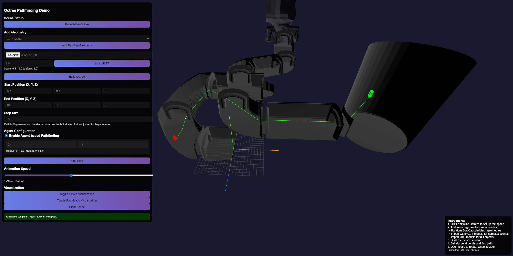

# octree-go

A Go implementation of an Octree spatial partitioning and pathfinding library, supporting efficient collision detection and path planning in 3D environments.



## Features

- **Octree Space Partitioning**: Efficient 3D space segmentation and management
- **Agent Pathfinding**: Supports agent navigation with capsule-shaped agents (considers agent size)
- **A* Pathfinding**: A* algorithm for efficient pathfinding
- **Multi-shape Support**: Geometric primitives including triangles, boxes, and capsules
- **Web API**: RESTful API endpoints for easy integration
- **Real-time Visualization**: Built-in web interface for visualizing octrees and paths

## Installation
- install by go get
  ~~~shell
    go get github.com/o0olele/octree-go
  ~~~


## New Agent Pathfinding Capabilities

### Agent Concept
Agents are represented as capsules with:
- **Radius**: Cross-sectional radius of the capsule
- **Height**: Height of the cylindrical portion (excluding hemispherical ends)

### API Updates

#### Pathfinding Request (POST /findpath)
```json
{
    "start": {"x": -8.0, "y": 0.0, "z": 0.0},
    "end": {"x": 8.0, "y": 0.0, "z": 0.0},
    "step_size": 0.5,
    "agent_radius": 0.5,    // Optional
    "agent_height": 1.8     // Optional
}
```

#### Collision Check (GET /checkoccupied)
```
GET /checkoccupied?x=0&y=0&z=0&agent_radius=0.5&agent_height=1.8
```

### Usage Examples

#### Basic Pathfinding (Point Navigation)
```go
// Create octree
bounds := octree.AABB{
    Min: octree.Vector3{X: -10, Y: -10, Z: -10},
    Max: octree.Vector3{X: 10, Y: 10, Z: 10},
}
tree := octree.NewOctree(bounds, 6, 0.5)

// Add obstacle
box := octree.Box{
    Center: octree.Vector3{X: 0, Y: 0, Z: 0},
    Size: octree.Vector3{X: 2, Y: 4, Z: 2},
}
tree.AddGeometry(box)
tree.Build()

// Create pathfinder
pathfinder := octree.NewAStarPathfinder(tree, 0.5)

// Point pathfinding
start := octree.Vector3{X: -8, Y: 0, Z: 0}
end := octree.Vector3{X: 8, Y: 0, Z: 0}
path := pathfinder.FindPath(start, end)
```

#### Agent Pathfinding (Size-Aware)
```go
// Create agent
agent := octree.NewAgent(0.5, 1.8) // Radius=0.5, Height=1.8
pathfinder.SetAgent(agent)

// Agent pathfinding
path := pathfinder.FindPath(start, end)

// Check agent collision at position
position := octree.Vector3{X: 1, Y: 0, Z: 0}
occupied := tree.IsAgentOccupied(agent, position)
```

### Collision Detection Principles

#### Capsule vs. Primitive Detection
- **Capsule vs. Triangle**: Minimum distance from capsule axis to triangle edges
- **Capsule vs. Box**: Distance from closest point on capsule axis to box surface
- **Capsule vs. Capsule**: Shortest distance between capsule axes

#### Optimization Strategies
- AABB-based broad-phase collision detection
- Precise collision detection only for passing geometries
- Octree spatial partitioning to reduce collision checks

## Running Tests

```bash
# Compile and run web server
go build -o octree-server .
./octree-server
```

## Web Interface
Access visualization at `http://localhost:8080`

## API Documentation

### Initialize Octree
- **POST** `/init`
- **Body**: `{"bounds": {...}, "max_depth": 6, "min_size": 0.5}`

### Add Geometry
- **POST** `/addgeometry`
- **Body**: `{"type": "box|triangle|capsule", "data": {...}}`

### Build Octree
- **POST** `/build`

### Find Path
- **POST** `/findpath`
- **Body**: `{"start": {...}, "end": {...}, "step_size": 0.5, "agent_radius": 0.5, "agent_height": 1.8}`

### Check Occupancy
- **GET** `/checkoccupied?x=0&y=0&z=0&agent_radius=0.5&agent_height=1.8`
