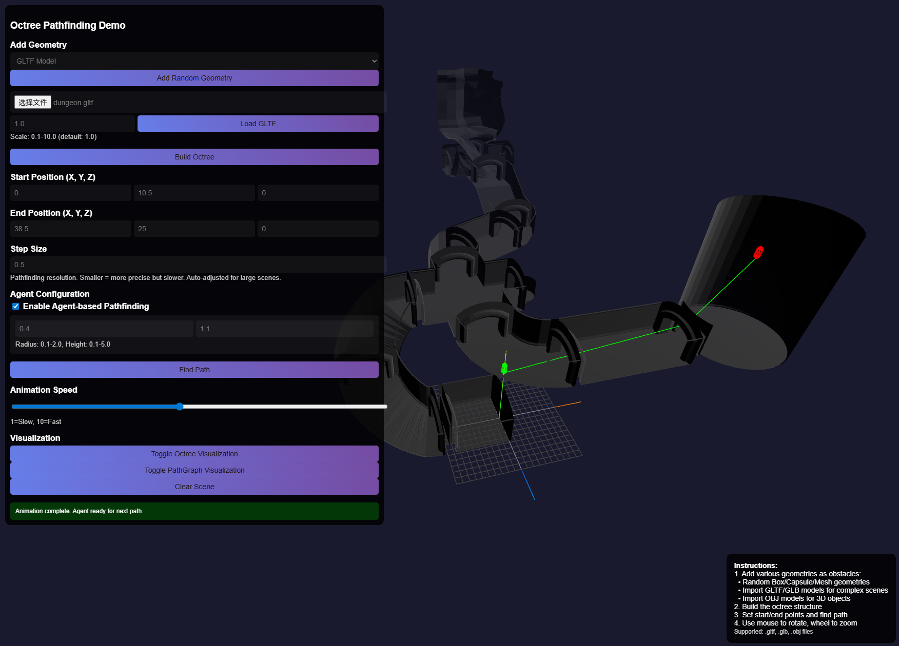

# octree-go

A Go implementation of an Octree spatial partitioning and pathfinding library, supporting efficient collision detection and path planning in 3D environments.



## Features

- **Octree Space Partitioning**: Efficient 3D space segmentation and management
- **Agent Pathfinding**: Supports agent navigation with capsule-shaped agents (considers agent size)
- **A-Star Pathfinding**: A* and Bidirectional A* algorithm for efficient pathfinding
- **Multi-shape Support**: Geometric primitives including triangles, boxes, and capsules
- **Web API**: RESTful API endpoints for easy integration
- **Real-time Visualization**: Built-in web interface for visualizing octrees and paths

## Installation
- install by go get
  ~~~shell
    go get github.com/o0olele/octree-go
  ~~~

## Usage

### Build navigation data
```go
bounds := geometry.AABB{
	Min: math32.Vector3{X: -10, Y: -10, Z: -10},
	Max: math32.Vector3{X: 10, Y: 10, Z: 10},
}

// Create a new navigation builder
navBuilder := builder.NewBuilder(bounds, 10, 1, 1)

// Use voxel for collision detection
navBuilder.SetUseVoxel(true)

// Add obstacles
navBuilder.AddTriangle(geometry.Triangle{
	A: math32.Vector3{X: 0, Y: 0, Z: 0},
	B: math32.Vector3{X: 1, Y: 0, Z: 0},
	C: math32.Vector3{X: 0, Y: 1, Z: 0},
})

// Create a new agent
agent := octree.NewAgent(0.4, 1)

// Build the navigation data
navData, err := navBuilder.Build(agent)
if err != nil {
	log.Fatalf("Failed to build navigation data: %v", err)
}

// Save the navigation data to a file
builder.Save(navData, "navigation.bin")
```

### Query navigation data
```go
// Load the navigation data
navData, err := builder.Load("navigation.bin")
if err != nil {
	log.Fatalf("Failed to load navigation data: %v", err)
}

// Create a new navigation query
q, err := query.NewNavigationQuery(navData)
if err != nil {
	log.Fatalf("Failed to create navigation query: %v", err)
}

// Set the agent  
q.SetAgent(octree.NewAgent(0.4, 1))

// Find the path
path := q.FindPath(math32.Vector3{X: 0, Y: 0, Z: 0}, math32.Vector3{X: 10, Y: 10, Z: 10})

// Print the path
fmt.Println(path)
```

## Visualization

### Build

- First clone the repository
  ```bash
  git clone https://github.com/o0olele/octree-go.git
  ```
- Run the server
  ```bash
  go run main.go
  ```
- Access the visualization at `http://localhost:8080`

### Web Interface

- Initialize Octree
  
  Click the "Initialize Octree" button to initialize the octree.

- Add Geometry
  
  Then you can add geometry to the octree. 
  
  Gltf and Obj files are supported. After load the 3d model, you need to click "Re-Initialize Octree" to update the octree bounds, and then click "Load Gltf/Obj" button to reload the 3d model.

- Build Octree

  Click the "Build Octree" button to build the octree and the navigation data. 
  
  For agent usage, you need enable the "Enable agent-base Pathfinding" checkbox before build.

- Find Path

  After build, you can click the "Find Path" button to find the path.

  You can set the start and end points, and the step size.

### API

- Initialize Octree
  - **POST** `/init`
  - **Body**: `{"bounds": {...}, "max_depth": 6, "min_size": 0.5}`

- Add Geometry
  - **POST** `/addgeometry`
  - **Body**: `{"type": "box|triangle|capsule", "data": {...}}`

- Build Octree
  - **POST** `/build`

- Find Path
  - **POST** `/findpath`
  - **Body**: `{"start": {...}, "end": {...}, "step_size": 0.5, "agent_radius": 0.5, "agent_height": 1.8}`

- Check Occupancy
  - **GET** `/checkoccupied?x=0&y=0&z=0&agent_radius=0.5&agent_height=1.8`
